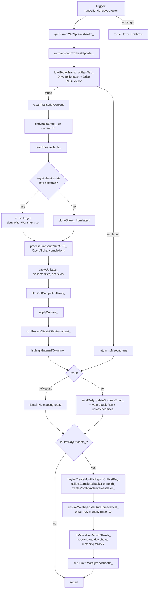

# main.js — Analysis for n8n Port

Source: `infor/appscript/main.js` (1100 lines, Google Apps Script).
Purpose: read today's Komosion stand-up transcript from Drive → ask GPT for a patch plan → apply updates/creates to the current month's Google Sheet → email team. On the 1st of the month, also generate a "Team Achievements" doc for the previous month and roll over to a new monthly spreadsheet.

Target n8n destination: `wip_task` sheet of `komosion_helpdesk_tickets_v2.xlsx` (Supabase-backed `wip_tasks` table per `p1_core_schema.sql`).

---

## 1. Function Inventory

| # | Name | Purpose | Inputs | Outputs | External calls |
|---|---|---|---|---|---|
| 1 | `runDailyWipTaskCollector` | Entry point. Runs daily flow; on 1st-of-month does rollover + monthly report. Global try/catch → email on error. | none (trigger) | `{ok}` or rethrows | `MailApp.sendEmail`, `PropertiesService`, indirectly: Drive, Sheets, OpenAI |
| 2 | `cleanTranscriptContent` | Strips header/footer noise, timestamps, redundant title from raw transcript. Anchors at last `📖 Transcript`. | `text:string` | cleaned string | none (regex only) |
| 3 | `computeTodaySheetName_` | Format today as `dd_MM_yy`. | `now, tz` | string | `Utilities.formatDate` |
| 4 | `cloneSheet_` | Deletes existing target sheet if any, copies "today" sheet into spreadsheet, renames, moves to position 1. | `ss, todaySheet, targetSheetName` | new `Sheet` | `SpreadsheetApp` |
| 5 | `filterOutCompletedRows_` | Deletes rows where Status normalises to `complete` (bottom-up). | `sheet` | void (mutates) | `SpreadsheetApp` |
| 6 | `normalizeStatus_` | Lowercase + trim + NBSP→space. | value | string | none |
| 7 | `sortProjectClientWithInternalLast_` | Sort rows by "Project / Client" A→Z, push `Internal` to bottom. | `sheet` | void (mutates) | `SpreadsheetApp` |
| 8 | `highlightInternalColumnA_` | Conditional formatting rule: highlight `Internal` rows light blue in col A. | `sheet` | void | `SpreadsheetApp` |
| 9 | `runTranscriptToSheetUpdater_` | Core flow: load transcript, clean, snapshot tasks, call LLM, apply patch. | `spreadsheetId, now` | `{ok,targetSheetName,todayTag,unmatchedTitles,doubleRunWarning}` or `{noMeeting:true}` | Drive, Sheets, OpenAI |
| 10 | `computeTargetSheetName_` | Tomorrow's `dd_MM_yy`, skipping Sat/Sun → Monday. | `now, tz` | string | `Utilities.formatDate` |
| 11 | `findLatestSheet_` | Pick the most recent sheet whose name matches `DD_MM_YY` (holiday-safe). | `ss` | `Sheet` | `SpreadsheetApp` |
| 12 | `loadTodayTranscriptPlainText_` | Scan a Drive folder for file whose name contains today's `yyyy/MM/dd` and the prefix; export as text/plain via Drive REST. | `folderId, filePrefix, tz, now` | string or null | `DriveApp`, `UrlFetchApp`, `ScriptApp.getOAuthToken` |
| 13 | `readSheetAsTable_` | Read range, map header→col index, return `{headers, rows[{rowIndex, project, task, lead, status, note, next, colMap}]}`. | `sheet` | table object | `SpreadsheetApp` |
| 14 | `appendNote_` | Append new note line, cap at 800 chars (trim oldest lines first). NOTE: currently unused — callers commented out. | `oldNote, newContent` | string | none |
| 15 | `applyUpdates_` | Apply `updates[]` patch. Validates `match.title` ∈ existing titles; returns unmatched list. Sets lead/status/next_step/note. | `sheet, table, updates` | `unmatchedTitles[]` | `SpreadsheetApp` |
| 16 | `applyCreates_` | Insert N rows after last, copy format + data validation from template (last row of today sheet), fill values. | `sheet, table, creates, todaySheet` | void | `SpreadsheetApp` |
| 17 | `mergeNotes_` | Join two notes with `\n`, trimming empties. Unused at runtime. | `a, b` | string | none |
| 18 | `processTranscriptWithGPT_` | OpenAI Chat Completions call (`gpt-4.1-2025-04-14`, temp 0.2, `response_format: json_object`). Returns `{updates, creates, merges}`. | `cleanedTranscript, currentTasksJson, todayTag` | JSON object | `UrlFetchApp` → OpenAI, `PropertiesService` |
| 19 | `getCurrentWipSpreadsheetId_` | Read `DAILY_WIP_SPREADSHEET_ID` Script Property, fallback hardcoded id. | none | string | `PropertiesService` |
| 20 | `setCurrentWipSpreadsheetId_` | Write Script Property. | id | void | `PropertiesService` |
| 21 | `isFirstDayOfMonth_` | Day == 1 in given TZ. | `dateObj, tz` | bool | `Utilities.formatDate` |
| 22 | `formatMonthYearEn_` | "Mon YYYY" (e.g. `Jan 2026`). | `dateObj, tz` | string | `Utilities.formatDate` |
| 23 | `ensureMonthlyFolderAndSpreadsheet_` | Ensure child folder + spreadsheet for month; create if missing, move out of root. Email once per month via `DAILY_WIP_LAST_MONTHLY_NOTIFY`. | `parentFolderId, monthLabel, ...` | `{folderId, spreadsheetId, spreadsheetName}` | DriveApp, SpreadsheetApp, MailApp, Props |
| 24 | `ensureChildFolderByName_` | Find or create folder by name under parent. | `parentFolderId, childName` | Folder | DriveApp |
| 25 | `findSpreadsheetInFolderByName_` | First sheet file matching name in folder. | `folder, fileName` | File or null | DriveApp |
| 26 | `tryMoveNewMonthSheets_` | Copy any `DD_MM_YY` sheets that belong to *new* month from old SS to new SS, delete from old (logical cut). | `oldId, newId, dateObj, tz` | void | SpreadsheetApp |
| 27 | `sendTaggedEmail_` | `MailApp.sendEmail(to, subject, body, {cc})`. | subject, body, to, cc | void | MailApp |
| 28 | `sendDailyUpdateSuccessEmail_` | Build & send success email with link to today's target tab; append warnings for double-run and unmatched LLM titles. | many | void | MailApp, SpreadsheetApp |
| 29 | `getMonthFolder_` | Duplicate of `ensureChildFolderByName_` (used by monthly doc path). | `parentFolderId, folderName` | Folder | DriveApp |
| 30 | `parseDailySheetNameToDate_` | Parse `DD_MM_YY` → `Date`. | `name, tz` | Date or null | none |
| 31 | `collectCompletedTasksForMonth_` | Iterate all daily sheets of given month, collect rows with `status == complete`. | `ssId, monthDate, tz` | `[{dateStr,project,task,lead,note}]` | SpreadsheetApp |
| 32 | `createMonthlyAchievementsDoc_` | Build "Team Achievements - Mon YYYY" Google Doc grouped by lead, save to month folder. | `parentFolderId, ssId, prevMonthDate, tz` | `{docId,docUrl,folderName}` | DocumentApp, DriveApp |
| 33 | `applyDocumentTypography_` | Set Poppins + body size across doc body. | doc | void | DocumentApp |
| 34 | `styleParagraph_` | Per-paragraph font/size/bold/italic/spacing helper. | para, opts | para | DocumentApp |
| 35 | `addSpacer_` | Append empty paragraph with spacingAfter. | body, pxAfter | void | DocumentApp |
| 36 | `maybeCreateMonthlyReportOnFirstDay_` | On day==1, build report for previous month and email link. | parentFolderId, ssId, tz, to, cc, tag | `{docId,docUrl,folderName}` or null | DocumentApp via #32, MailApp |

Module-level constants: `HEADER_IMAGE_FILE_ID`, `DOC_FONT_FAMILY="Poppins"`, `FONT_SIZE_BODY=11`, `FONT_SIZE_H1=20`, `FONT_SIZE_H2=14`, `FONT_SIZE_H3=12`.

Latent bug: `cleanTranscriptContent` writes `startIndex` without `let/const` — leaks to global scope (harmless in GAS, would `ReferenceError` in n8n's `strict`/Function node).

---

## 2. Mermaid — `runDailyWipTaskCollector` flow

---

## 3. Script Properties used

| Property | Read by | Written by | Purpose |
|---|---|---|---|
| `OPENAI_API_KEY` | `processTranscriptWithGPT_` | (manual) | OpenAI bearer token |
| `DAILY_WIP_SPREADSHEET_ID` | `getCurrentWipSpreadsheetId_` | `setCurrentWipSpreadsheetId_` | Active monthly spreadsheet; advanced on 1st of month. Fallback hard-coded id `1qBj0_Xl3DwzS6tdjP9yP0iWOsW8-SHwTxgLiClX13M4` if unset. |
| `DAILY_WIP_LAST_MONTHLY_NOTIFY` | `ensureMonthlyFolderAndSpreadsheet_` | same | Idempotency key `monthLabel:ssId` so the "new monthly spreadsheet" email fires once per month. |

Other hard-coded constants treated as configuration:
- `EMAIL_TO = "truc.pham@komosion.com"`, `EMAIL_CC = "support@komosion1.com"`, `EMAIL_TAG = "[Daily WIP Task Collector]"`
- `parentFolderId = "1ECMirvCmZ8q53HknsztjsYOfxujarhgD"` (Komosion Daily WIP root)
- `driveFolderId = "13fESz8TAxlz4dpummSBPiM-GwfG1S_Nr"` (transcript folder)
- `filePrefix = "Komosion stand up"`
- `tz = "GMT+7"` (used both for transcript date and sheet date)
- `HEADER_IMAGE_FILE_ID = "1HTWmMeJisNr6sjQHNLNkYn8a9gaNTJ2D"` (loaded but actually never referenced inside `createMonthlyAchievementsDoc_` — dead constant)
- Model: `gpt-4.1-2025-04-14`, temp 0.2, `response_format: json_object`

---

## 4. Edge cases

### No transcript today
- `loadTodayTranscriptPlainText_` returns `null` if no file in folder matches both `filePrefix` and today's `yyyy/MM/dd`.
- Core flow short-circuits with `{noMeeting:true}`.
- Entry point sends "No meeting today" email. **Monthly rollover still runs after the no-meeting branch** — so 1st-of-month with no transcript still creates new SS and report.

### Monthly rollover (1st of month)
- Detected by `isFirstDayOfMonth_` (TZ-aware via `Utilities.formatDate(... "d")`).
- Order matters: daily flow runs first on the *old* spreadsheet, *then* rollover. So Day-1 daily output lands in old SS, then `tryMoveNewMonthSheets_` cuts it across to the new SS.
- `previous month` for the report is computed via `new Date(year, month-1, 1)` → handles January correctly (rolls to Dec of prior year).
- `tryMoveNewMonthSheets_` filter is `MM == today.MM && YY == today.yy` — silently no-op if no day sheets match. `sh.copyTo()` then `deleteSheet()` is a logical cut.
- `ensureMonthlyFolderAndSpreadsheet_` is idempotent — re-running the same day will not duplicate folder or spreadsheet, and the email is gated by `DAILY_WIP_LAST_MONTHLY_NOTIFY`.

### Duplicate detection / double-run guard
- For the *daily* tab: `runTranscriptToSheetUpdater_` checks if the target sheet (tomorrow's `dd_MM_yy`) already exists *and* has `lastRow > 1`. If so, it **skips cloning** and applies the LLM patch directly on the existing target. `doubleRunWarning=true` is bubbled to email.
- For the *monthly* spreadsheet: `findSpreadsheetInFolderByName_` re-uses existing file in folder.
- For the *monthly notification email*: gated by Script Property `DAILY_WIP_LAST_MONTHLY_NOTIFY`.
- LLM title duplication: `applyUpdates_` rejects any `match.title` not in the live set (returned in `unmatchedTitles`).
- `applyCreates_` does **not** dedupe — if LLM emits a create whose title already exists, it will append a row. (DB-side: `wip_tasks` has `UNIQUE(project_client, task)` — n8n insert will conflict.)

### Empty task list from LLM
- `processTranscriptWithGPT_` returns `{updates:[], creates:[], merges:[]}` (defaulted in catch-all).
- Validation: `if (!patchPlan || (!patchPlan.updates && !patchPlan.creates && !patchPlan.merges))` — note `!updates` is `false` for `[]` (truthy), so empty arrays pass validation.
- `applyUpdates_` returns `[]` immediately if `updates.length===0`. `applyCreates_` returns immediately if no creates.
- Net effect: clone exists, filterOutCompletedRows still runs, sort+format runs, success email fires with no warnings.

### Other edges seen in code
- Holiday/weekend: `computeTargetSheetName_` skips Sat→Mon, Sun→Mon; `findLatestSheet_` chooses most-recent dated tab regardless of name math (covers gaps when triggers were missed).
- Notes truncation logic in `appendNote_` exists but is **dead** — both call sites use raw `note_append`/`note` instead.
- `merges` field declared in the GPT contract but never applied in code.
- `cleanTranscriptContent` is case-sensitive and depends on the literal "📖 Transcript" anchor surviving the Drive→text export.

---

## 5. AppScript → n8n mapping

n8n recommendation: use the latest **Google Drive node** (file search + download), **Google Sheets node** (read/append/update — *not* needed if Supabase is canonical), **Postgres / Supabase node** for `wip_tasks` writes, **OpenAI / LangChain node** for the patch-plan call, **Gmail node** for emails, **Code (JS)** nodes for pure transforms, **Set + IF + Schedule Trigger** for branching. Specialised community nodes worth checking: `n8n-nodes-google-sheets-batch`, `n8n-nodes-supabase` (built-in), `n8n-nodes-openai-tools` for structured JSON output.

| AppScript function | n8n node(s) | Notes |
|---|---|---|
| `runDailyWipTaskCollector` (trigger) | **Schedule Trigger** (cron, TZ=Asia/Ho_Chi_Minh) | One workflow per concern; sub-workflow for rollover via **Execute Workflow** on Day-1 branch (IF node). |
| Global try/catch + error email | **Error Trigger** workflow → **Gmail** | Wire workflow-level error output to an Error Trigger; mirrors `try/catch` semantics. |
| `getCurrentWipSpreadsheetId_` / `setCurrentWipSpreadsheetId_` | **Supabase** row in `system_config` (or n8n **Workflow Static Data**) | Per memory `project_system_config_migration`, tunables already live in Supabase `system_config`. Reuse that pattern; avoid n8n Credentials for runtime-mutable IDs. |
| `loadTodayTranscriptPlainText_` | **Google Drive: Search files** (query `name contains "Komosion stand up" and name contains "<yyyy/MM/dd>"`) → **Google Drive: Download file** (`mimeType=text/plain` export) | Use Drive node's "Convert to text" / export option. Falls back to HTTP Request node if export-format is unavailable. |
| `cleanTranscriptContent` | **Code (JavaScript)** node | Pure string transform; copy regex as-is. Fix `startIndex` to `let`. |
| `findLatestSheet_` / `readSheetAsTable_` (sheet read) | Replace with **Supabase: Select** from `wip_tasks` `WHERE status != 'complete' ORDER BY last_updated DESC` | The Excel/Sheet "today sheet" snapshot becomes a row set from Postgres. No more day-tabs. If the project still needs the Sheets mirror, use **Google Sheets: Read rows**. |
| `cloneSheet_` / `applyCreates_` template-copy | **Drop entirely** when persisting to Supabase | Sheet-clone is a Sheets-only concept (formatting + validation copy). In DB world, "tomorrow's tab" is just rows with a new `as_of_date`. If a Sheets mirror is still required, use **Google Sheets: Append rows** + a separate formatting step. |
| `processTranscriptWithGPT_` | **OpenAI** node (Chat model) with `response_format=json_object` *or* **LangChain "Information Extractor"** node | Pass `system` + `user` prompt via expressions. Title enum list built in a preceding **Set** node. Same model id `gpt-4.1-2025-04-14`, temp 0.2. Consider structured-output / function-calling variant for stronger title-enum enforcement. |
| `applyUpdates_` | **Code** node (title validation, build patches) → **Supabase: Update** in a loop (or `Supabase: Upsert` keyed by `(project_client, task)`) | Loop via "Run Once for Each Item". Unmatched titles → collect into a separate workflow variable for the email. |
| `applyCreates_` | **Supabase: Insert** keyed by `(project_client, task)` with `ON CONFLICT` upsert | Avoids the no-dedupe bug. Set `origin_source='standup'`. |
| `filterOutCompletedRows_` | Replaced by `WHERE status != 'complete'` in the initial Supabase select | No deletion needed — completed rows simply aren't re-emitted. |
| `sortProjectClientWithInternalLast_` / `highlightInternalColumnA_` | **Drop** (DB-side) or move to a Sheets-mirror sub-workflow | Sorting is a view concern; do it in the consuming Sheet/UI. |
| `appendNote_` / `mergeNotes_` | **Code** node if you re-enable note appending | Both currently dead in AppScript; ignore unless behaviour is restored. |
| `sendTaggedEmail_` / `sendDailyUpdateSuccessEmail_` | **Gmail: Send a message** (or **Send Email**) | Build subject/body via expressions; conditionally include warnings via IF + Set. |
| `isFirstDayOfMonth_` / `formatMonthYearEn_` | **DateTime** node / **IF** node with `{{$now.setZone('Asia/Ho_Chi_Minh').day === 1}}` | Use Luxon expressions; do not parse with system tz. |
| `ensureMonthlyFolderAndSpreadsheet_` | **Google Drive: Search folder → Create folder if missing** + **Google Sheets: Create spreadsheet** (or skip entirely under Supabase model) | If keeping monthly Sheets mirror, this is two Drive ops; idempotency key kept in `system_config`. |
| `tryMoveNewMonthSheets_` | **Drop entirely** under Supabase model | If retaining Sheets, custom logic via Google Sheets API (HTTP Request) — there is no first-class "move sheet between spreadsheets" node. |
| `collectCompletedTasksForMonth_` | **Supabase: Select** `WHERE status='complete' AND date_trunc('month', last_updated) = $month` | Single query replaces sheet-by-sheet iteration. |
| `createMonthlyAchievementsDoc_` (+ typography helpers) | **HTTP Request** to Google Docs API (`documents.batchUpdate`), or **Google Docs** community node (`n8n-nodes-google-docs` / `@hugorezende/n8n-nodes-google-docs-advanced`) | Built-in Docs support is limited; community node recommended. Group by lead inside a **Code** node before the doc build. |
| `maybeCreateMonthlyReportOnFirstDay_` | **IF (day==1)** → **Execute Sub-Workflow** "Monthly Report" | Keeps the Day-1 branch isolated; safer to retry. |

---

## 6. Risks for porting to n8n

### Sheet-specific APIs that don't translate cleanly
- **`templateRange.copyTo(destRange, PASTE_FORMAT, PASTE_DATA_VALIDATION)`** in `applyCreates_` — Google Sheets node has no equivalent for *format-and-validation-only* paste. If a Sheets mirror is retained, must call Sheets API v4 `batchUpdate` via HTTP Request (CopyPasteRequest with `pasteType=PASTE_FORMAT` then `PASTE_DATA_VALIDATION`).
- **`SpreadsheetApp.newConditionalFormatRule()`** (`highlightInternalColumnA_`) — requires Sheets API v4 `addConditionalFormatRule` request; not exposed by the standard n8n Google Sheets node.
- **`insertRowsAfter` + `setActiveSheet` + `moveActiveSheet(1)`** (`cloneSheet_`) — moving a sheet to position 1 needs `updateSheetProperties` with `index` via Sheets API.
- **Cross-spreadsheet `sh.copyTo(newSS)`** (`tryMoveNewMonthSheets_`) — possible via Sheets API `spreadsheets.sheets.copyTo`, but no n8n-native node; needs HTTP Request.
- **`ss.getSheetByName().getSheetId()`** for the per-tab URL anchor (`#gid=`) — n8n Google Sheets node returns row data but not always sheet metadata in one call; may need a second Sheets API call.
- **Implicit recommendation:** stop mirroring to Sheets and write straight to `wip_tasks` (Supabase). The complex Sheets ops above all dissolve.

### Time-zone handling
- AppScript uses `Utilities.formatDate(date, "GMT+7", fmt)` — a fixed offset, **not** an IANA zone. It does not observe DST (Vietnam doesn't use DST so fine for now, but brittle if expanded). In n8n use Luxon `setZone('Asia/Ho_Chi_Minh')` instead; expressions like `{{$now.setZone('Asia/Ho_Chi_Minh').toFormat('dd_MM_yy')}}`.
- `loadTodayTranscriptPlainText_` matches `"yyyy/MM/dd"` *literally inside the filename* — fragile if Read.ai or upstream tool changes its naming. Verify the actual transcript filename pattern before porting; consider a wider regex.
- `computeTargetSheetName_` rebuilds a local `Date` from a formatted string (`new Date(yyyyMMdd + "T00:00:00")`) — that constructed Date is in the **n8n container's local TZ**, not GMT+7. Reproduce with Luxon's `DateTime.fromISO(..., {zone: 'Asia/Ho_Chi_Minh'})`. AppScript got away with this because `getDay()` is fed an offset that happens to align; n8n containers run UTC by default and will produce off-by-one on weekend skip.
- `parseDailySheetNameToDate_` constructs `new Date(yy, mm-1, dd)` — local TZ again. Same caveat.

### GAS-only features (need replacement)
| GAS API | Replacement |
|---|---|
| `PropertiesService.getScriptProperties()` | n8n **Workflow Static Data** for state, **Credentials** for secrets, or `system_config` table (already in use per memory). |
| `ScriptApp.getOAuthToken()` | OAuth2 credential on Google Drive node, or a Service Account credential. No "current user token" concept. |
| `UrlFetchApp.fetch` | **HTTP Request** node (already covered by OpenAI node). |
| `DriveApp` (`getFolderById`, `getFiles`, `createFolder`, `addFile`, `getRootFolder().removeFile`) | Google Drive node (Search, Create folder, Move file). Note: moving out of "My Drive" root needs explicit Drive: Update with new `parents`. |
| `SpreadsheetApp` (full API) | Google Sheets node + Sheets API via HTTP Request for advanced ops. |
| `DocumentApp` (typed body/paragraph/list-item API) | Google Docs community node or `documents.batchUpdate` HTTP calls. No 1:1 mapping for the strongly-typed paragraph builder. |
| `MailApp.sendEmail(to, subject, body, {cc})` | Gmail node, or SMTP node. CC handled via field. |
| Triggers (time-based) | Schedule Trigger. |
| `console.log` | n8n run logs; no `console.warn`/`console.error` distinction — use workflow logging or pin data. |
| File mime-type sniff via `MimeType.GOOGLE_SHEETS` | Filter on `mimeType=application/vnd.google-apps.spreadsheet` string. |

### Behavioural / logic risks (not API)
- **No transactional guarantee**: AppScript's row-level writes are sequential and tolerate partial failure. In n8n, between `applyUpdates_` and `applyCreates_`, a failed item halts the run mid-write unless **Continue On Fail** is set. Decide explicit retry/atomicity policy per node.
- **LLM JSON validity**: AppScript throws on bad JSON. n8n's OpenAI node will pass through invalid JSON unless `response_format` is set; use the structured-output variant.
- **Title enum scaling**: prompt embeds all current task titles. With Supabase as source of truth, that list will grow well past Sheets-era size. Consider filtering by recent/non-closed before passing to LLM (memory: `wip_task` linking already implies LLM matcher pattern).
- **`HEADER_IMAGE_FILE_ID` is unused** — don't reproduce.
- **`merges[]` is in the GPT contract but never consumed** — drop from prompt to simplify.
- **Day-1 ordering**: AppScript runs daily flow on *old* SS, then rolls. In n8n make this explicit — running the rollover branch first would write Day-1 data to the new SS, which is also valid but a behavioural change.
- **Idempotency**: Day-2 re-run currently re-uses the same target tab (double-run guard). Replicate with: query `wip_tasks` for rows updated today, decide whether to re-apply patch or short-circuit. Don't rely solely on a "tab already exists" check, since DB has no such concept.
- **Email destination is hard-coded** — move to `system_config` so non-engineers can change it without redeploying the workflow.
